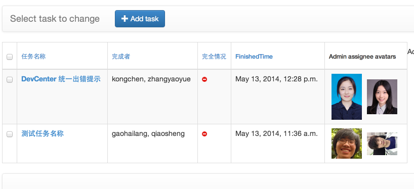
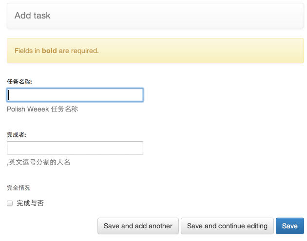

### Summary
Wandoulabs Polish Week dashboard which is located office front's Tv. backend in Django(ಥ_ಥ, use django to create admin-site much much easier than Express.js)
之前尝试了backend-less的方案如deployd(无法快捷的加入onPost, onPut自动加上modified, created字段通过后台), firebase(后台真是很难用啊...)

### Screencast





### TODO

- [ ] - 实现listView table中的inline edit 或者是通过batchAction实现快速编辑, fun!
- [ ] - 探索实施下Django 下的 realtime api 方案, fun!
- [ ] - mock data and then focus on the front end page

### Data Layer

#### task相关：
主要的字段包括如下：

- taskName - string
- Assignee - list [(string) -> peopleName] 会通过此调用who.wandoulabs的数据取得头像
- Status - list[被提出，开始做，提交验证，验证通过]

使用包括：

- get /status=done 的所有task用来轮播
- done number / total number , 获得当前完成的状态
- 后台来导入polish week tasks 列表
- 后台来比较task is done


#### team相关：

- teamName - string which identifys the virtual team
- processStatus - 进度 在road上前进几步(共20步)

使用包括：

- 取得所有teamName list 并绘制到road上，并且realtime with it
- 在后台手动改变processStatus值

### Dependencies

- django
- djangorestframework
- django-admin-bootstrapped
- django-csvimport

### Setup

#### 从Google Sheet导入数据
manage.py csvimport --mappings='' --model='app_label.model_name' 

--model='admin.Task'
For mappings enter a list of fields in order only if you dont have a header row 
with matching field names - or you want to override it.


#### 利用Redis, Socket.IO 来提供realtime API
http://maxburstein.com/blog/realtime-django-using-nodejs-and-socketio/


```shell
# Set up a new project
django-admin.py startproject tutorial
cd tutorial

# Create a virtualenv to isolate our package dependencies locally
virtualenv env
source env/bin/activate  # On Windows use `env\Scripts\activate`

# Install Django and Django REST framework into the virtualenv
pip install django
pip install djangorestframework

# Create a new app
python manage.py startapp quickstart
```